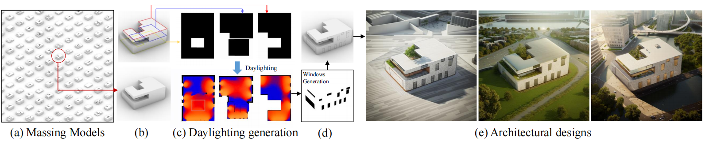

# Generating Daylight-driven Architectural Design via Diffusion Models

[](https://arxiv.org/abs/2404.13353)
[](https://zrealli.github.io/DDADesign/)

This repository contains the official implementation of the following paper:
> **Generating Daylight-driven Architectural Design via Diffusion Models** <br>

<div>
    <h4 align="center">
        
    </h4>
</div>


## :open_book: Overview
In this paper, we present a novel daylight-driven AI-aided architectural design method. Firstly, we formulate a method for generating massing models, producing architectural massing models using random parameters quickly. Subsequently, we integrate a daylight-driven facade design strategy, accurately determining window layouts and applying them to the massing models. Finally, we seamlessly combine a large-scale language model with a text-to-image model, enhancing the efficiency of generating visual architectural design renderings. Experimental results demonstrate that our approach supports architects' creative inspirations and pioneers novel avenues for architectural design development.


## :four_leaf_clover: Download Dataset

We provide the daylighting dataset in ```./dataset``` for training. For more personal floorplan data, you can refer to ```./tools/daylighting_gen.gh``` to generate more corresponding daylighting maps.


## :hammer: Quick Training
You can refer to the following repositories ([sd-scripts](https://github.com/kohya-ss/sd-scripts) and [lora-scripts](https://github.com/Akegarasu/lora-scripts) ) for training your models.

## :four_leaf_clover: Acknowledgments
This project is distributed under the MIT License. Our work builds upon the foundation laid by others. We thank the contributions of the SD community.

## :fountain_pen: Citation

   If you find our repo useful for your research, please consider citing our paper:

   ```bibtex
@article{li2024generating,
  title={Generating daylight-driven architectural design via diffusion models},
  author={Li, Pengzhi and Li, Baijuan},
  journal={arXiv preprint arXiv:2404.13353},
  year={2024}
}

   ```
